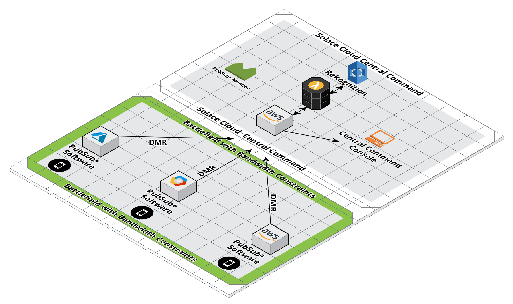

# geekathon-team-6 README

## What does this demonstrate?
This demonstrates the use of event-mesh for a use case for the US Army. The objective is to run the message brokers in a bandwidth constrained enviornment such as a war-zone. 

For this demo, the "war-zones" were simulated by deploying a web-app and VMRs to multiple clouds. The "netem" command was used on the servers to limit bandwidth.



### Cloud Services Used
The brokers were hosted in AWS, GCP and Azure. In addition, AWS Rekognition was used for the AI/ML features.

  
### Solace PubSub+ features used
List of PubSub+ features used ...

* DMR
* RDP
* MQTT/Websockets


**Try the live demo in action here:


## Contents


This repository contains three subfolders:

* rekognition: This folder contains the code for the Rekognition Lambda
* mobile-app: This folder contains the code for the mobile/web app that the soldiers would use in the battlefield
* dashboard-app: This folder contains the code for the dashboard that subscribes to the Solace PubSub+ Software broker hosted in Solace Cloud and displays the results of the Rekognition API

## Checking out

To check out the project, clone this GitHub repository:

```
git clone https://github.com/solacese/geekathon-team-6
cd geekathon-team-6
```

## Running the Demo

To run each component, navigate to the subfolder (mobile-app and dashboard-app) and follow the steps located there. The rekogonition lambda will have to be deployed in AWS for it to take affect


## Contributing

Please read [CONTRIBUTING.md](CONTRIBUTING.md) for details on our code of conduct, and the process for submitting pull requests to us.

## Authors

See the list of [contributors](https://github.com/solacese/geekathon-team-6/graphs/contributors) who participated in this project.

## License

This project is licensed under the Apache License, Version 2.0. - See the [LICENSE](LICENSE) file for details.

## Resources

For more information try these resources:

- The Solace Developer Portal website at: http://dev.solace.com
- Get a better understanding of [Solace technology](http://dev.solace.com/tech/).
- Check out the [Solace blog](http://dev.solace.com/blog/) for other interesting discussions around Solace technology
- Ask the [Solace community.](http://dev.solace.com/community/)

